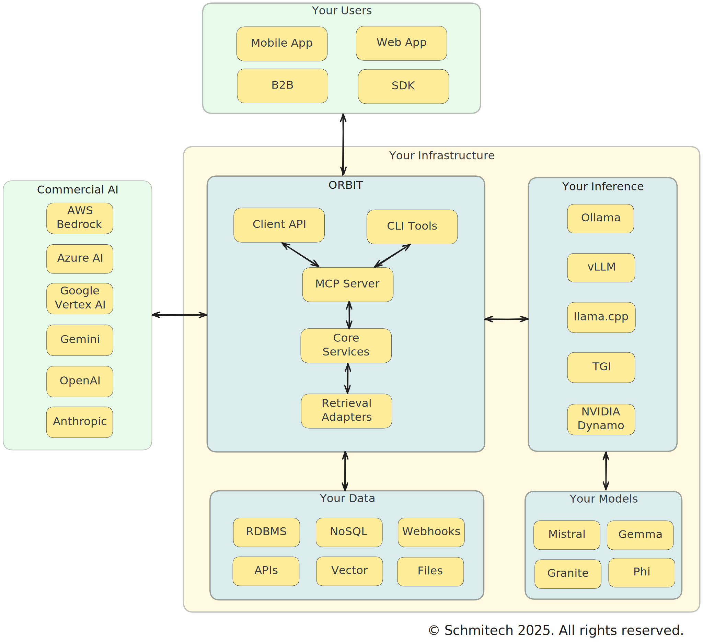

<div align="center">
  
  
  <h1>ORBIT</h1>
  <h2><strong>Open Retrieval-Based Inference Toolkit</strong></h2>
  
  <p>
    <a href="#-key-features">Features</a> •
    <a href="#-quick-start">Quick Start</a> •
    <a href="#-installation">Installation</a> •
    <a href="#-usage">Usage</a> •
    <a href="#-license">License</a>
  </p>
</div>

## 🎯 Overview

ORBIT is a modular, self-hosted toolkit that provides a unified API for open-source AI inference models. It enables you to interact AI models on your own infrastructure, maintaining complete control over your data while eliminating commercial API dependencies.

## Sovereignty and Data Control

ORBIT is designed with digital sovereignty in mind, offering several key advantages:

1. **Complete Data Control**: All data processing happens on your infrastructure, ensuring sensitive information never leaves your environment
2. **No External Dependencies**: By eliminating reliance on commercial AI APIs, you maintain full control over your AI capabilities
3. **Compliance Ready**: Self-hosted deployment makes it easier to comply with data residency requirements and privacy regulations
4. **Transparency**: Open-source nature allows full visibility into the system's operations and data handling
5. **Customization**: Ability to modify and adapt the system to meet specific organizational or national requirements

This makes ORBIT particularly valuable for:

- Government agencies requiring sovereign AI capabilities
- Organizations with strict data privacy requirements
- Countries implementing digital sovereignty initiatives
- Enterprises needing to maintain control over their AI infrastructure

## 🏗️ Architecture



## 🚀 Quick Start

### System Requirements

- A device (Win/Linux or Mac) with 16GB memory, GPU preferred.
- Python 3.12+
- MongoDB for API key management
- Optional: Redis for caching responses or chat history (coming soon)
- Ollama (preferred), llama.cpp ot vLLM for inference (other services supported, see config.yaml)
- Optional: Elasticsearch for logging

### 1. Setup

```bash
# Clone the repository
git clone https://github.com/schmitech/orbit.git
cd orbit

# Install dependencies (see ./install/dependencies.ymol for installation options)
./install/setup.sh --profile minimal # Add --download-gguf flag to pull a GGUF file if using llama-cpp

# Activate virtual environment
source venv/bin/activate
```

### 2. Inference Provider 

For local development you can use either Ollama (recommended) or llama-cpp python lib.

#### Ollama Instructions:

https://ollama.com/download

```bash
# Download the models
ollama pull gemma3:1b
ollama pull nomic-embed-text
```

#### Llama-cpp instructions
First install the dependencies and GGUF file (by default t downloads Gemma3:1b from Hugging Face, see ./install.stup.sh for details, you can change the download command to use your preferred model):

./install/setup.sh --profile minimal --download-gguf

### 3. Configuration
Edit config.yaml with default settings:
```yaml
general:
  port: 3000
  verbose: true
  https:
    enabled: false
    port: 3443
    cert_file: "./cert.pem"
    key_file: "./key.pem"
  session_id:
    header_name: "X-Session-ID"
    required: true
  inference_provider: "ollama" #or llama_cpp
  language_detection: false
  inference_only: false # Set to true for simple chat with no RAG
  adapter: "sqllite
```

### 4. Launch Server
```bash
./bin/orbit.sh start ## other option: status - stop - restart
```

> **Note:** If you set `inference_only: true` in your configuration, you can skip steps 5 and 6 as they are only needed for RAG (Retrieval-Augmented Generation) functionality. Simply jump to step 7 to start interacting with the server right away (simple inference does not enforce an API Key).  

### 5. API Key Management
```bash
# Create an API key for a collection. Only needed to RAG operatons
# A collection is an abstraction of an SQL database, collection (noSQL) or index (elasticearch)
# Exampple:

./bin/orbit.sh key create --collection city --name "Ciy Assistant" --prompt-file prompts/examples/city/city-assistant-normal-prompt.txt  --prompt-name "City Assistant Prompt"

# List API keys
./bin/orbit.sh key list

# Test an API key
./bin/orbit.sh key test --key your-api-key
```

### 6. Sample Database Setup
```bash
# Use --no-api-keys flag if api keyalready available

# For SQLite database
./install/setup-demo-db.sh sqlite

# For Chroma database (requires Ollama running with nomic-embed-text model)
./install/setup-demo-db.sh chroma
```

### 7. Client Setup

#### Python Client

```bash
pip install schmitech-orbit-client

# The chat client implementation can be found in /clients/python/schmitech_orbit_client/chat_client.py
orbit-chat --url http://localhost:3000 --api-key orbit-api-key
```

## 📚 Documentation

For more detailed information, please refer to the following documentation in the `/docs` folder.

## 🤝 Contributing

Contributions are welcome! Please read our [Code of Conduct](CODE_OF_CONDUCT.md) for details the process for submitting pull requests.

## 📃 License

This project is licensed under the Apache 2.0 License - see the [LICENSE](LICENSE) file for details.