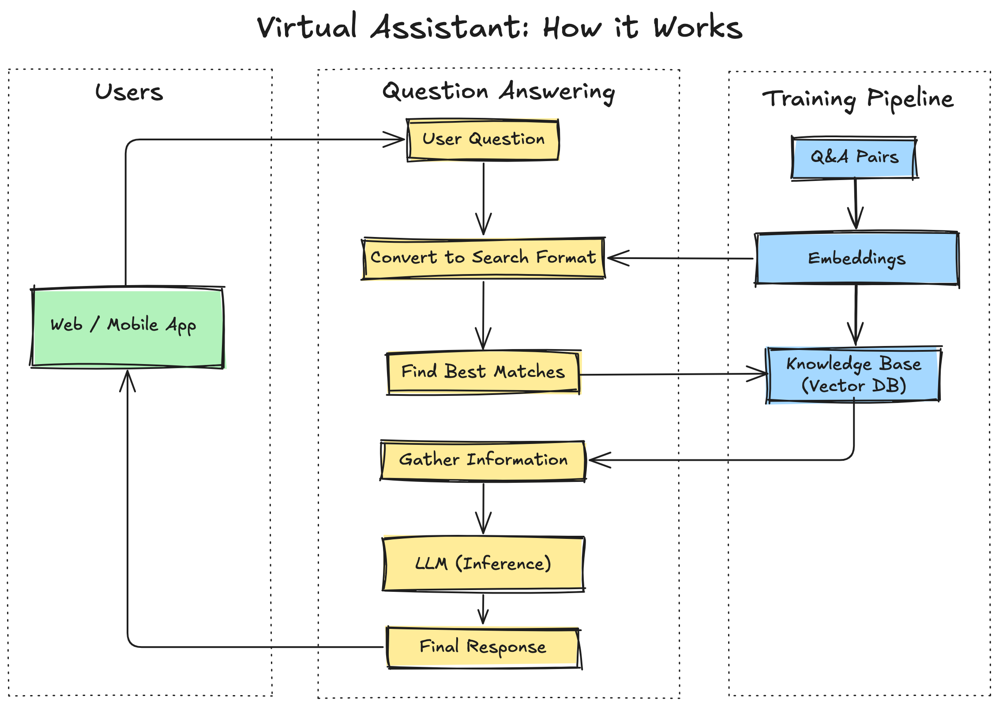

# QA Chatbot Server

A Node.js server for Q/A chatbots with text-to-speech capabilities.

## Architecture



## Prerequisites

- Node.js (v16 or higher)
- Python (for ChromaDB)
- An ElevenLabs API key (for text-to-speech)
- Ollama server
- ChromaDB server

## Setup as Server

1. Install dependencies
```bash
npm install
```

2. Configure the application
   
   The application uses a YAML configuration file (`config.yaml`) instead of environment variables. A sample configuration file is provided:
   
   ```bash
   # Copy the example config and modify as needed
   cp config.yaml.example config.yaml
   ```
   
   Edit the `config.yaml` file to set your:
   - Ollama parameters (model, temperature, etc.)
   - HuggingFace API key
   - ChromaDB connection details
   - ElevenLabs API key and voice ID
   - System template path

3. Install Chroma server (skip if chroma is running separately)
   ```bash
   python -m venv venv 
   source venv/bin/activate
   pip install -r requirements.txt
   ```

4. Start ChromaDB (in simple-qa-chatbot terminal venv)
```bash
chroma run --host localhost --port 8000 --path ./chroma_db
```

5. Ingest data (in another simple-qa-chatbot terminal)
```bash
python ../chroma/create-chroma-collection.py qa-pairs.json
```
5.1 Test ingested data, example:
```bash
python ../chroma/query-chroma-collection.py "Where can I view the assessment roll for my property taxes?"
```

## Configuration Options

The `config.yaml` file contains the following sections:

```yaml
ollama:
  base_url: "http://localhost:11434"  # URL of your Ollama server
  temperature: 0.0                    # Controls randomness (0.0 = deterministic)
  top_p: 0.1                          # Nucleus sampling parameter
  top_k: 10                           # Limits token selection to top K options
  repeat_penalty: 1.2                 # Penalizes repetition
  num_predict: 256                    # Maximum tokens to generate
  num_ctx: 2048                       # Context window size
  num_threads: 8                      # CPU threads to use
  model: "llama3.2:3b"                # Ollama model to use
  embed_model: "nomic-embed-text"     # Embedding model for vector search

huggingface:
  api_key: "your-api-key"             # HuggingFace API key
  model: "deepset/roberta-base-squad2" # HF model for question answering

chroma:
  host: "localhost"                   # ChromaDB host
  port: 8000                          # ChromaDB port
  collection: "qa-chatbot"            # Collection name

eleven_labs:
  api_key: "your-api-key"             # ElevenLabs API key
  voice_id: "voice-id"                # Voice ID to use

system:
  template_path: "../templates/qa.txt" # Path to system prompt template

general:
  verbose: "false"                    # Enable verbose logging
```

## Testing Text-to-Speech
You can test your ElevenLabs API key with:
```bash
curl -X POST "https://api.elevenlabs.io/v1/text-to-speech/XrExE9yKIg1WjnnlVkGX" \
  -H "xi-api-key: $ELEVEN_LABS_API_KEY" \
  -H "Content-Type: application/json" \
  -d '{"text": "Test audio generation", "model_id": "eleven_monolingual_v1"}' \
  --output test.mp3
```

6. Start the server:
```bash
npm run server -- ollama #or hf for hugging face
```

## API Client

The project includes a reusable API client library in the `api` directory. This library can be used by any client application to interact with the chatbot server.

### Using the API Client

1. Build the API client:
```bash
cd api
npm install
npm run build
```

2. Use it in your projects:
```bash
npm install /path/to/chatbot-api
```

Or publish it to npm:
```bash
cd api
npm publish
```

Then install it in your projects:
```bash
npm install chatbot-api
```

### Testing the API Client

The API client includes a comprehensive test suite using Vitest and MSW (Mock Service Worker) for mocking HTTP requests.

To run the tests:

```bash
cd api
npm test                 # Run tests once
npm run test:watch       # Run tests in watch mode
npm test -- --coverage   # Run tests with coverage report
```

The tests verify:
- Basic chat functionality without voice
- Chat with voice enabled
- Error handling for network issues

The test suite uses MSW to mock server responses, so you don't need an actual server running to test the API client.

For more details on the tests, see the [API tests README](api/test/README.md).

See the [API client README](api/README.md) for more details on usage.